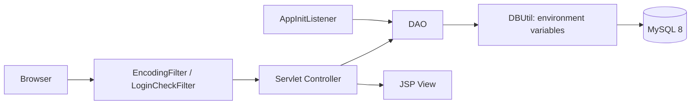

# Step-up Backend: Mock-to-SQL Migration Board

Servlet/JSP 기반 게시판을 메모리 저장소에서 MySQL 기반 MVC 애플리케이션으로 전환한 학습 프로젝트입니다. 데이터 접근 분리, 인증, 스키마 정합성, 실행 가능성을 실제 코드와 격리 환경 검증으로 개선했습니다.

> 한계: Servlet/JSP와 JDBC 학습을 목적으로 한 프로젝트이며, Spring Boot 기반 서비스는 아닙니다.

## Problem

초기 구현은 `MockDB`의 Java Collection에 데이터를 보관해 서버 재시작 시 데이터가 사라지고, 관계·제약 조건·실제 SQL 페이징을 검증할 수 없었습니다. 또한 DB 접속 정보의 소스 고정, SHA-256 기반 비밀번호 처리, DAO가 기대하는 `views` 열과 초기 스키마의 불일치가 배포·보안·재현성을 떨어뜨렸습니다.

## Solution

- `MockDB`에서 MySQL 8과 JDBC/DAO 구조로 전환해 영속성, FK 제약, SQL 기반 검색·페이징을 검증했습니다.
- DB URL·계정·비밀번호를 환경변수로 외부화하고, 설정 누락·연결 실패 시 민감값을 포함하지 않는 오류를 반환합니다.
- 회원 비밀번호를 BCrypt로 저장하고 세션과 `LoginCheckFilter`로 게시판 접근을 제어합니다.
- `init.sql`, DAO, 자동화 테스트를 함께 정비해 새 DB에서도 `views` 기본값과 조회수 증가가 동작하도록 만들었습니다.

`com.test.db.MockDB`는 전환 과정을 보여 주는 Deprecated 학습 기록이며, 현재 실행 흐름에서는 사용하지 않습니다.

## Architecture



- Servlet은 요청·세션·화면 이동을 담당하고, SQL은 DAO에 한정합니다.
- `DBUtil`은 `DB_URL`, `DB_USERNAME`, `DB_PASSWORD`를 검증한 뒤 JDBC 연결을 만듭니다.
- `AppInitListener`는 환경변수가 있을 때만 초기 관리자 계정을 생성합니다.

구성 요소별 책임과 전체 흐름은 [아키텍처 문서](docs/architecture.md)에서 확인할 수 있습니다.

## Core Engineering Decisions

### 공지와 일반글을 분리한 페이징

공지사항은 모든 페이지의 상단에 유지되어야 하므로, 공지 전용 조회와 일반글 목록 조회를 분리했습니다. 일반글만 카테고리·검색 조건과 `LIMIT` 기반 페이지 계산에 포함하며, 목록 쿼리와 총 개수 쿼리에 같은 조건을 적용해 페이지 수가 실제 결과와 맞도록 했습니다.

### BCrypt, 환경변수, 세션 필터

- BCrypt는 매 해시마다 새 salt를 생성하고, 로그인에서는 평문 재해시 대신 `matches()`로 저장 해시를 검증합니다.
- DB credential과 초기 관리자 비밀번호는 소스가 아닌 환경변수에서 공급합니다.
- 로그인 성공 시 `loginUser`를 세션에 저장하고, `LoginCheckFilter`가 보호된 게시판 경로의 미인증 접근을 차단합니다.

### 데이터 무결성과 조회수

`board_tbl.views`는 `INT NOT NULL DEFAULT 0`으로 정의해 신규 게시글의 상태를 DB에서 보장합니다. 상세 조회 시 작성자 본인이 아닌 로그인 사용자의 요청에 한해 `views = views + 1` SQL로 원자적으로 증가시킵니다. 댓글은 게시글 삭제 시 `ON DELETE CASCADE`로 정리됩니다.

인증, DB 스키마, 개선 배경의 상세 근거는 [인증 문서](docs/authentication.md), [데이터베이스 문서](docs/database.md), [개선 이력](docs/troubleshooting.md)에 정리했습니다.

## Features

- 회원가입과 BCrypt 기반 로그인, ID 기억 쿠키
- 세션 기반 게시판 접근 제어와 작성자 수정·삭제 권한 제어
- 공지 상단 고정, 카테고리·제목·본문·작성자 검색, SQL `LIMIT` 페이징
- 게시글 CRUD, 작성자 조건 조회수 증가, 댓글 작성·조회·삭제
- 게시글 삭제 시 연관 댓글 자동 삭제

## Tech Stack

| 영역 | 기술 |
| --- | --- |
| Language / Web | Java 17, Jakarta EE 10, Servlet 6.0, JSP 3.1, JSTL 3.0, EL |
| Database | MySQL 8, JDBC, MySQL Connector/J |
| Security | BCrypt, HTTP Session, Servlet Filter |
| Build / Server | Maven 3.9+, Apache Tomcat 11 |
| Verification | JUnit 5, Docker MySQL 8 |

## Testing

`PasswordUtil`의 BCrypt 일치·불일치, `DBUtil`의 안전한 설정 누락 오류, `BoardDAO`의 공지 분리·검색·페이징·`views 0 → 1`을 검증합니다.

실제 검증 환경은 **Java 17 / Apache Tomcat 11 / MySQL 8**입니다. Docker 기반 격리 환경에서 Maven 빌드, WAR 배포, 회원가입·로그인·게시판 접근 및 DAO 통합 테스트를 실행했습니다.

테스트 범위와 실행 방법은 [테스트 가이드](docs/testing.md)를 참고하세요.

## Run Guide

### 프로젝트 경로와 요구 사항

저장소 루트는 `LWJ_Backend`이고 Maven 모듈은 `BackendMaster`입니다. Maven 명령은 반드시 `BackendMaster`에서 실행합니다.

- JDK 17
- Maven 3.9 이상
- MySQL 8.0 이상
- Apache Tomcat 11

### 1. 데이터베이스 초기화

MySQL에서 `backend_master` 스키마를 생성한 뒤 [init.sql](BackendMaster/src/main/resources/sql/init.sql)을 실행합니다. 이 스크립트에는 기존 테이블을 삭제하는 `DROP TABLE` 문이 있으므로, 보존할 데이터가 있는 DB에는 실행하지 마세요.

### 2. 환경변수 설정

`DBUtil`은 운영체제 환경변수에서 접속 정보를 읽습니다. 루트의 [.env.example](.env.example)을 참고하세요. `.env` 파일은 안내용이며 애플리케이션이 자동으로 읽지는 않습니다.

```powershell
$env:DB_URL = "jdbc:mysql://localhost:3306/backend_master?serverTimezone=Asia/Seoul"
$env:DB_USERNAME = "your_mysql_username"
$env:DB_PASSWORD = "your_mysql_password"
$env:ADMIN_INITIAL_PASSWORD = "choose_a_strong_development_password"
```

빈 개발 DB에서 `ADMIN_INITIAL_PASSWORD`를 설정한 채 서버를 시작하면 `AppInitListener`가 `admin` 계정을 생성합니다. 이 값을 설정하지 않으면 관리자 생성은 건너뛰며, 일반 회원은 `join.jsp`에서 가입할 수 있습니다.

### 3. 빌드와 Tomcat 배포

```powershell
cd BackendMaster
mvn clean package
Copy-Item .\target\BackendMaster-0.0.1-SNAPSHOT.war "$env:CATALINA_BASE\webapps\ROOT.war"
```

Tomcat을 시작한 뒤 `http://localhost:8080/`에 접속합니다. 로그인 후 게시판은 `http://localhost:8080/BoardListServlet`에서 확인할 수 있습니다.

## Troubleshooting

- SHA-256 기존 데이터는 BCrypt 검증과 호환되지 않습니다. 개발 DB를 초기화하고 새 해시를 생성하세요.
- DB 연결 오류 시 `DB_URL`, `DB_USERNAME`, `DB_PASSWORD`가 현재 실행 프로세스에 설정됐는지 확인하세요. 오류 메시지에는 접속 값이 출력되지 않습니다.
- `init.sql`은 `views`를 포함한 현재 DAO 스키마를 생성합니다. 부분 적용 대신 깨끗한 개발 DB 초기화를 권장합니다.
- Maven Compiler는 Java 17 `release`로 통일했습니다. JDK 버전이 다르면 Java 17로 빌드하세요.

문제별 원인과 개선 결정은 [개선 이력](docs/troubleshooting.md)에서 확인할 수 있습니다.
