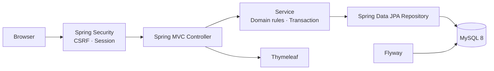

# Step-up Backend

Servlet/JSP·JDBC 학습 프로젝트를 Spring Boot 기반 게시판으로 전환한 프로젝트입니다. 기존 회원가입, 세션 로그인, 공지 고정, 검색·페이징, 조회수, 댓글, 작성자 권한 규칙을 유지하면서 Spring MVC, Spring Security, JPA, Flyway 구조로 재설계했습니다.

## Problem → Solution

- 직접 JDBC 중심 구현의 데이터 보존, 스키마 변경 이력, 계층별 테스트 한계를 Spring Boot 실행 JAR와 Flyway 마이그레이션으로 개선했습니다.
- Spring Data JPA Repository와 Service 계층으로 데이터 접근과 도메인 규칙을 분리했습니다.
- Spring Security의 form login과 HTTP 세션으로 서버 렌더링 웹에 적합한 인증 흐름을 유지했습니다.

기존 Servlet/JSP 구현은 `BackendMaster/src/legacy`에 보존했습니다. 전환 전 기능 계약은 [기준선 문서](docs/spring-boot-migration-baseline.md)를 참고하세요.

## Architecture



- [아키텍처](docs/architecture.md): 계층별 책임과 요청 흐름
- [인증](docs/authentication.md): BCrypt, 세션, CSRF, 권한
- [데이터베이스](docs/database.md): ERD, FK, Flyway 정책
- [테스트](docs/testing.md): 단위·Web·MySQL 통합·E2E 검증

## Core Engineering Decisions

### 공지와 일반글을 분리한 페이지 설계

공지는 모든 페이지 상단에 고정해야 하므로 공지 전용 조회와 일반글 검색·페이징 조회를 분리했습니다. 일반글만 페이지 수와 검색 조건에 포함합니다.

### JPA와 Flyway

JPA는 Entity 관계와 Repository 기반 조회로 DAO 반복 코드를 줄이고 Service 트랜잭션 경계를 명확히 합니다. 스키마는 JPA 자동 생성에 맡기지 않고 Flyway로 버전 관리합니다.

### BCrypt와 세션 인증

비밀번호는 Spring Security `PasswordEncoder`로 BCrypt 해시만 저장합니다. 브라우저 중심 서버 렌더링 화면에서는 세션 인증이 단순하고 CSRF 보호와 자연스럽게 결합되므로 유지했습니다. 작성자 권한은 Service에서도 검증합니다.

## Features

- 회원가입, BCrypt 로그인·로그아웃, 세션 기반 접근 제어
- 공지 상단 고정, 카테고리·제목·본문·작성자 검색, 페이징
- 게시글 작성·수정·삭제, 작성자 외 사용자만 조회수 증가
- 댓글 작성·삭제, 게시글 삭제 시 댓글 cascade
- 사용자용 오류 화면과 민감정보를 기록하지 않는 요청 로그

## Tech Stack

| 영역 | 기술 |
| --- | --- |
| Language / Web | Java 17, Spring Boot 3, Spring MVC, Thymeleaf |
| Persistence | Spring Data JPA, Flyway, MySQL 8 |
| Security | Spring Security, BCrypt, HTTP Session, CSRF |
| Build / Run | Maven 3.9+, executable JAR, embedded Tomcat |
| Test | JUnit 5, Mockito, MockMvc, Docker MySQL 8 |

## Run Guide

Maven 모듈은 `BackendMaster`입니다. JDK 17과 Maven 3.9 이상이 필요합니다. 이 저장소에는 Maven Wrapper가 없으므로 `mvn`을 사용합니다.

### 1. Docker MySQL 시작

```powershell
docker run -d --name step-up-mysql -p 3306:3306 `
  -e MYSQL_DATABASE=backend_master `
  -e MYSQL_USER=app_user `
  -e MYSQL_PASSWORD=local_app_password `
  -e MYSQL_ROOT_PASSWORD=local_root_password `
  mysql:8.4
```

애플리케이션 시작 시 Flyway가 `db/migration/V1__create_initial_schema.sql`을 적용합니다. 기존 DB를 삭제하거나 레거시 `init.sql`을 실행할 필요가 없습니다.

### 2. 환경변수 설정

[.env.example](.env.example)은 형식 안내용이며 애플리케이션이 `.env`를 자동으로 읽지는 않습니다.

```powershell
$env:DB_URL = "jdbc:mysql://localhost:3306/backend_master?serverTimezone=Asia/Seoul"
$env:DB_USERNAME = "app_user"
$env:DB_PASSWORD = "local_app_password"
$env:ADMIN_INITIAL_PASSWORD = "choose_a_strong_development_password" # 선택 사항
```

`ADMIN_INITIAL_PASSWORD`를 설정하면 `admin` 계정이 없을 때에만 초기 계정을 만듭니다. 설정하지 않아도 회원가입 화면에서 일반 계정을 만들 수 있습니다.

### 3. 실행

```powershell
cd BackendMaster
mvn spring-boot:run
```

또는 실행 JAR를 만듭니다.

```powershell
cd BackendMaster
mvn clean package
java -jar target/step-up-backend-0.0.1-SNAPSHOT.jar
```

`http://localhost:8080/`에서 시작하고, 로그인 뒤 `/boards`에서 게시판을 사용합니다. 포트는 `SERVER_PORT` 환경변수로 바꿀 수 있습니다.

## Testing

```powershell
cd BackendMaster
mvn test
```

DB 환경변수가 없으면 MySQL Repository 통합 테스트는 자동으로 건너뜁니다. Docker MySQL 통합·E2E 방법은 [테스트 가이드](docs/testing.md)에 있습니다.

## Limits and Next Steps

이 프로젝트는 Spring Boot 계층화와 서버 렌더링 학습을 위한 게시판입니다. OAuth2, 비밀번호 재설정, 파일 업로드, 운영 모니터링, 무중단 배포는 아직 구현하지 않았습니다.

REST API를 추가할 때 Controller에서 API DTO를 제공하고 Service·Repository·Entity는 재사용할 수 있습니다. SPA나 모바일 클라이언트를 별도 배포하는 시점에는 세션 인증을 JWT 또는 OAuth2 기반 토큰 인증으로 확장할 수 있습니다.
