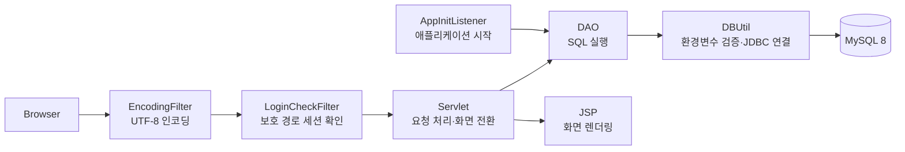

# 아키텍처

이 프로젝트는 JSP/Servlet 기반 MVC 구조에서 컨트롤러와 데이터 접근 책임을 분리한다. 브라우저 요청은 Filter를 거쳐 Servlet에 도달하고, Servlet은 DAO를 통해서만 MySQL에 접근한다. JDBC 연결 정보는 `DBUtil`이 환경변수에서 읽는다.

## 책임 분리

| 구성 요소 | 책임 |
| --- | --- |
| `EncodingFilter` | 모든 요청과 응답의 UTF-8 인코딩을 적용한다. |
| `LoginCheckFilter` | `board.jsp`, 게시글 목록·작성·삭제 요청 등 설정된 보호 경로에서 `loginUser` 세션 유무를 확인하고, 미인증 요청을 로그인 화면으로 보낸다. |
| Servlet | HTTP 파라미터와 세션을 해석하고, DAO 호출 결과를 JSP에 전달하거나 다음 화면으로 이동시킨다. |
| DAO | SQL과 ResultSet 매핑을 담당한다. Servlet은 JDBC API를 직접 사용하지 않는다. |
| `DBUtil` | `DB_URL`, `DB_USERNAME`, `DB_PASSWORD`를 검증하고 JDBC 연결을 생성한다. 실패 메시지에는 접속 값이나 비밀번호를 포함하지 않는다. |
| `AppInitListener` | 서버 시작 시 `admin` 계정이 없고 `ADMIN_INITIAL_PASSWORD`가 설정된 경우에만 BCrypt 해시를 만들어 초기 계정을 생성한다. |

## 게시판 조회 흐름

`BoardListServlet`은 공지와 일반글을 의도적으로 두 번 조회한다. 공지는 페이지와 무관하게 상단에 고정하고, 일반글만 카테고리·검색 조건과 `LIMIT` 기반 페이징에 포함한다. `getBoardList`와 `getTotalBoardCount`는 같은 필터 조건을 사용하므로 페이지 수와 목록 범위가 일치한다.

상세 요청에서는 `BoardDetailServlet`이 게시글을 먼저 조회한다. 로그인한 사용자가 작성자가 아닐 때만 `BoardDAO.incrementViewCount`가 `views = views + 1` SQL을 실행하며, 응답에 쓰는 DTO의 표시값도 함께 갱신한다.

## 레거시 경계

`com.test.db.MockDB`는 MySQL 전환 전의 학습 과정을 보여 주기 위한 Deprecated 클래스다. 현재 Servlet, DAO, `DBUtil`로 구성된 실행 경로에서는 참조하거나 사용하지 않는다.
