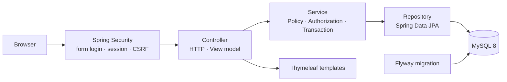

# 아키텍처

현재 실행 경로는 Spring Boot의 계층형 MVC 구조입니다. 레거시 Servlet/JSP·JDBC 구현은 `BackendMaster/src/legacy`에 보존되어 있으며 실행 JAR에는 포함되지 않습니다.

## 계층별 책임

| 계층 | 책임 |
| --- | --- |
| `security` | SecurityContext·세션, 보호 URL, CSRF를 처리한다. |
| `controller` | HTTP 파라미터·검증 오류를 다루고 Thymeleaf 모델 또는 redirect를 결정한다. |
| `service` | 회원가입, 공지/일반글 분리, 검색 검증, 조회수, 작성자 권한과 트랜잭션을 처리한다. |
| `repository` | JPA Entity 조회·저장과 게시글 검색·페이징 쿼리를 수행한다. |
| `domain` | `Member`, `Board`, `Comment` 관계와 값 변경 규칙을 표현한다. |
| `bootstrap` | 환경변수가 있을 때만 초기 관리자 계정을 생성한다. |
| `exception` | 사용자 메시지와 서버 안전 로그를 분리한다. |

## 게시글과 관측성

`BoardController`는 공지와 일반글을 별도 모델 값으로 전달합니다. `BoardService`는 공지(`공지`)를 별도 조회하고 일반글만 검색·페이지 조건에 넣습니다. 상세 조회는 작성자 본인 외 사용자에게만 `views`를 증가시키며, 수정·삭제는 Service에서 작성자 ID를 다시 확인합니다.

`RequestTimingInterceptor`는 메서드, 경로, 상태 코드, 처리 시간만 기록합니다. `GlobalExceptionHandler`는 입력 오류, 권한 오류, 리소스 없음, DB 장애를 공통 오류 화면으로 변환합니다. DB URL, JDBC 사용자명, 비밀번호, BCrypt 해시는 로그에 남기지 않습니다.

개발·운영 프로필은 `application-dev.yml`, `application-prod.yml`에서 템플릿 캐시와 로그 레벨을 분리합니다.
