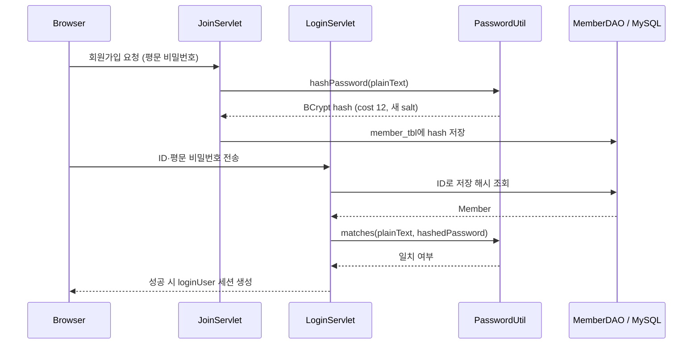

# 인증과 접근 제어

## 회원가입과 로그인

`PasswordUtil.hashPassword`는 매 호출마다 새 salt를 포함한 BCrypt 해시를 생성한다. 따라서 같은 비밀번호도 해시 문자열은 달라질 수 있다. 로그인은 평문을 다시 해시해 비교하지 않고 `PasswordUtil.matches(plainText, hashedPassword)`로 검증한다. 손상됐거나 형식이 맞지 않는 해시는 인증 실패로 처리한다.

## 세션 기반 보호

로그인에 성공하면 `LoginServlet`이 `loginUser`를 HTTP 세션에 저장한다. `LoginCheckFilter`는 게시글 화면과 주요 게시글 Servlet의 보호 경로에서 이 세션 값을 확인한다. 세션이 없으면 로그인 화면으로 리다이렉트하며, 로그인·회원가입 경로는 인증 없이 접근할 수 있다.

게시글 수정·삭제처럼 작성자 권한이 필요한 작업은 해당 Servlet과 JSP가 세션의 사용자 ID와 작성자 ID를 비교해 제어한다.

## 초기 관리자 계정

`AppInitListener`는 서버 시작 시 다음 조건을 모두 만족할 때만 `admin` 계정을 만든다.

1. `member_tbl`에 `admin`이 아직 없다.
2. `ADMIN_INITIAL_PASSWORD` 환경변수가 비어 있지 않다.

이 값은 BCrypt 해시로 변환된 뒤에만 DB에 저장된다. 환경변수가 없으면 초기 계정 생성을 건너뛰며, 비밀번호나 DB 접속 값은 로그에 기록하지 않는다.
