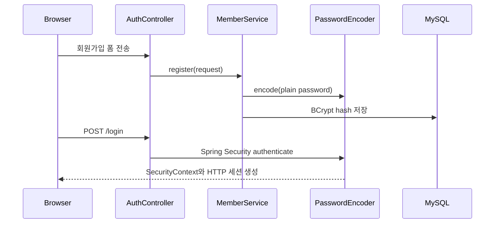

# 인증과 접근 제어

## 회원가입과 로그인

회원가입은 `MemberService`가 Spring Security `PasswordEncoder`로 입력 비밀번호를 BCrypt 해시로 바꾼 뒤 저장합니다. 로그인은 `DaoAuthenticationProvider`와 `MemberUserDetailsService`가 저장된 해시를 사용해 `matches()` 방식으로 검증합니다. 계정 존재 여부나 비밀번호 값은 실패 메시지와 로그에 노출하지 않습니다.

## 세션·CSRF·권한

- 공개 경로: 홈, 로그인, 회원가입, 정적 리소스
- 인증 경로: `/boards/**`, `/comments/**`
- 로그인 성공 사용자 정보는 SecurityContext와 HTTP 세션에 유지됩니다.
- 폼의 상태 변경 요청은 CSRF 토큰을 포함해야 합니다.
- 게시글·댓글 수정과 삭제는 Service가 작성자 ID를 다시 확인합니다. 화면의 버튼 숨김은 편의 기능일 뿐 권한 보장의 유일한 수단이 아닙니다.

세션 인증은 서버 렌더링 애플리케이션에서 쿠키·CSRF와 결합하기 간결해 현재 유지합니다. 외부 SPA·모바일 클라이언트가 주된 소비자가 되면 API 경계에 JWT 또는 OAuth2 토큰 인증을 도입할 수 있습니다.

## 초기 관리자

`ADMIN_INITIAL_PASSWORD`가 비어 있지 않고 `admin` 계정이 없을 때만 `AdminAccountInitializer`가 초기 계정을 생성합니다. 평문 비밀번호는 저장하거나 로그에 남기지 않습니다.
