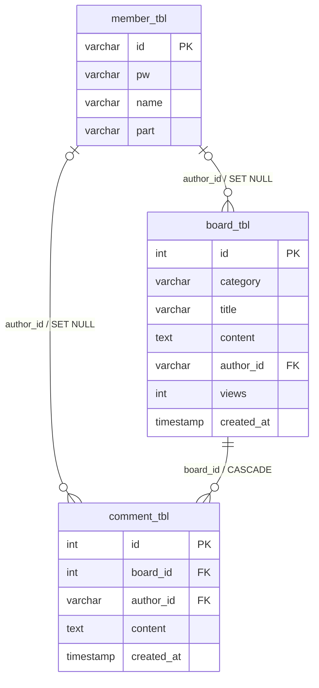

# 데이터베이스 설계와 마이그레이션

스키마는 Flyway의 [V1 마이그레이션](../BackendMaster/src/main/resources/db/migration/V1__create_initial_schema.sql)으로 관리합니다. 빈 MySQL에 애플리케이션을 시작하면 Flyway가 한 번 적용합니다. 운영 DB에는 직접 `DROP TABLE`을 실행하지 않고 다음 버전의 마이그레이션을 추가합니다.

| 테이블 | 핵심 규칙 |
| --- | --- |
| `member_tbl` | `id`가 PK이며 `pw`에는 BCrypt 해시만 저장한다. |
| `board_tbl` | `views INT NOT NULL DEFAULT 0`으로 새 게시글의 초기 조회수를 보장한다. 회원 삭제 시 작성자 FK는 `NULL`이 된다. |
| `comment_tbl` | 게시글 FK는 `ON DELETE CASCADE`다. 회원 삭제 시 작성자 FK는 `NULL`이 된다. |

JPA Entity의 관계는 DB FK 정책과 맞춘다. 특히 `Board` 삭제 시 JPA `CascadeType.REMOVE`와 MySQL `ON DELETE CASCADE`가 모두 댓글 정리를 보장합니다. Repository 통합 테스트가 실제 MySQL에서 이 동작과 조회수 증가를 검증합니다.

레거시 직접 실행 SQL은 `BackendMaster/src/legacy/sql`에 보존하며 현재 실행 경로에서 사용하지 않습니다.
