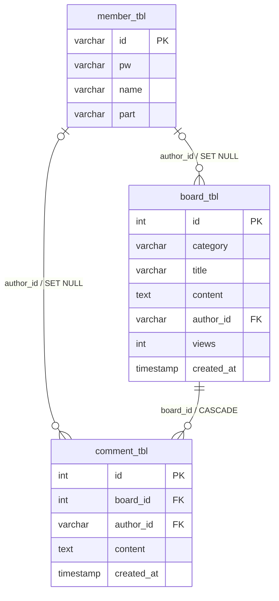

# 데이터베이스 설계

초기화 스크립트는 [init.sql](../BackendMaster/src/main/resources/sql/init.sql)에 있다. 개발 환경에서 실행하면 기존 테이블을 삭제하고 다시 만들므로, 운영 데이터나 보존할 개발 데이터에 실행해서는 안 된다.

## 테이블과 제약 조건

| 테이블 | 역할 | 핵심 제약 |
| --- | --- | --- |
| `member_tbl` | 회원 계정과 BCrypt 비밀번호 해시를 저장한다. | `id`는 PK, `pw`는 `VARCHAR(255) NOT NULL`이다. |
| `board_tbl` | 게시글과 조회수를 저장한다. | `author_id`는 회원 삭제 시 `NULL`로 남아 게시글을 보존한다. `views`는 `INT NOT NULL DEFAULT 0`이다. |
| `comment_tbl` | 게시글별 댓글을 저장한다. | `board_id`는 게시글 삭제 시 `ON DELETE CASCADE`로 함께 삭제된다. 작성자 회원이 삭제되면 `author_id`만 `NULL`이 된다. |

`views DEFAULT 0`은 신규 게시글의 최초 조회수를 DB 수준에서 보장한다. 조회수 증가는 애플리케이션이 값을 읽어 다시 저장하지 않고 `UPDATE board_tbl SET views = views + 1`로 수행한다.

초기 공지사항은 작성자 없이 삽입할 수 있도록 `board_tbl.author_id`가 nullable이다. 초기 관리자 계정은 SQL의 고정 해시가 아니라 애플리케이션 시작 시 환경변수 조건에 따라 생성된다.
